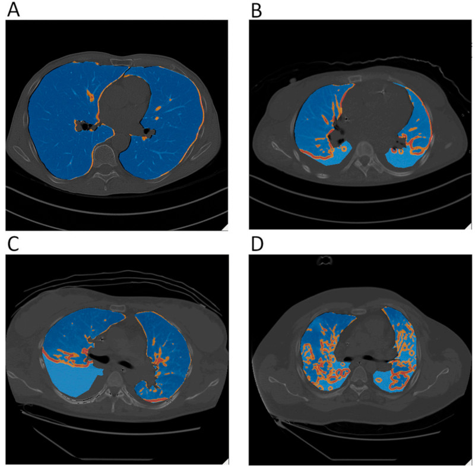

# Basics
1. How not to kill people with ventilators
2. Why would you get into this anyway?
3. General principles
4. Special circumstances

# How not to kill people with ventilators
The first few times you encounter a ventilator it's because somebody else has started it.

How do you use it safely and get through the first few shifts without being an expert, *and yet* not 
doing any avoidable damage to the most vulnerable patients in the hospital?

## Basic questions
- What organ failures are treated with a ventilator?
- How do you recognise them?
- How do you grade their severity?
- What are the usual ventilator settings?

## Lung Safe Ventilation
- Tidal volume 6 ml/kg ideal body weight
>- therefore tolerate <55mmHg PaCO2
- Peak pressure 35 cmH2O or lower
- PEEP for everyone, no ZEEP
- Sedation titrated to the patient
- Prone early
- No staircase recruitment
- No oscillator in ARDS
- Think of overinflation, gas trapping, collapse and atelectrauma

## How not to kill people with ventilators | Don't use them unless they're needed.  Duh.
- Don't view it as an end in itself
- Always project:
- Recognise your fear and listen to it

# Why would you get into this anyway?
Indications, evidence and practice

It is a solution, not a problem, a state or a result

It's a physiologically justified intervention

There are some safety tips

## Expert questions
- How do assess the relative contribution of organ system failures?
- How do you balance the treatment needs of each?
- What pathological pathways result in respiratory failure?
- How do you diagnose the aetiology?
- When do you need a CT scan?
- When do you need tissue?
- How do you predict outcome?

# General principles
Physiology, medicine, uncertainty and compassion

## Physiology
- Ventilators are used to supply oxygen and remove CO2 for less work by the patient
- The simplest way to view it is the most important

## Physiology | Oxygen

- Extra oxygen overcomes VQ mismatch
- It cannot correct for shunt

## Physiology | Oxygen

- How do you increase mixed venous O2 saturation?
- How do you decrease shunt flow?
- How do you decrease shunt fraction?
- How can oxygen be harmful?

## Physiology | Carbon dioxide

- Minute ventilation is VT * RR
- Dead space is the volume of each breath not engaging in gas exchange
- It correlates with severity in most lung disease
- How and where in the lung can dead space happen?
- What is a normal tidal volume?

## Physiology | Carbon dioxide

- What does carbon dioxide do to lungs?
- What does it do to the rest of the body?
- How can ventilation be harmful?

## Physiology | Work of breathing

- Define work
- What are the sources of impedance to breathing?

## Physiology | Work of breathing

- Define compliance
>- what is the normal compliance?
>- how does it depend on minute ventilation?
>- what are the sources of reduced compliance?
>- what can you do about them?

## Physiology | Work of breathing
- Define resistance
>- what is the normal resistance?
>- how does it depend on minute ventilation?
>- what are the sources of increased resistance?
>- what can you do about them?

## Physiology | Work of breathing
- Define capacitance
- This is not something you usually hear
>- capacitance is the ratio of change in charge for the resulting change in potential
>- by analogy, the ratio of change in volume for the resulting change in pressure
- The upper airway has capacitance during NIV
- Conducting airways have capacitance during rapid ventilation

## Physiology | Work of breathing
- 20% of "resting" critically ill energy expenditure is breathing

## Physiology | Control of breathing

- Alveolar ventilation, RR, inspiratory and expiratory effort separately controlled
- Grouped neurons interpret the pattern generator output
- Signals in the phrenic nerve to the diaphragm
- Diaphragm applies pressure to the pleura
- Lung deforms under pressure
- then micro changes in gas pressure cause flow

## Physiology | Control of breathing

- Afferents altered by inflammation
- Integration and efferents altered by sedation
- Mechanotransduction altered by load, electrolytes and NMJ

## Medicine | Disease specific treatments
- All the rest is supportive care
- The best you can do is not mess it up
- History, examination, google-fu

## Medicine | Timing
- Diseases each have their course
- Interfere with the least cost, to the most benefit

## Compassion
- It may be easier to palliate on a ventilator
- So don't be too fretful about the narrow calls
- Do allow time, even in the rush, for people to say honestly what they will tolerate

## Uncertainty | Sources of variation
- Heterogeneity of disease process
- Heterogeneity of treatment effect between patients
- Differential treatment effect between groups
- Variable treatment

## Uncertainty | Knowing and erring
- Treatment course is often controversial
- It's a wisdom thing
- See many patients, make predictions out loud
- Validate them against observed courses
- Know your own biases

# Special circumstances
ARDS

emphysema

asthma

pneumonia

Bronchopleural fistula

## ARDS
ARDS is a condition dear to the heart of Intensive Care Medicine

- We saw it first, we caused most of it and now we treat it all
- The first trials of pragmatic "housekeeping" were in ARDS
- A marker of severity
- A consequence of survival
- A target of therapy
- A statistical envelope
- A diagnosis?

## ARDS
Berlin definition

- PaO2:FiO2 ratio <300mmHg despite PEEP 5 cmH2O or more
- Within 1 week of a known insult
- Bilateral opacities
- Not fully explained by effusions, collapse or nodules
- Not fully explained by fluid overload or cardiac failure
- P:F <300 mild, <200 moderate, <100 severe

## ARDS
The pathway to treating ARDS well represents science used for clinical
practice.

There are few better examples of responsible academic medicine.

Sadly this is because it was a military condition largely affecting well-off
populations.

## ARDS
- Diffuse condition, affecting only some parts of the lung
- All sorts of inhomogeneities
>- which are not solved by PEEP
- dead space, compliance, resistance
- stress raiser

## ARDS

## ARDS
- Explain the contributors to the gradient in oxygen tension between inhaled gas and mitochondria?  Where are these altered in ARDS?
- What are the airflow abnormalities in ARDS? How are lung volumes altered?
- How is airway resistance defined and how is it altered in ARDS?  How is it measured?
- What is compliance?  When is it measured?  How is it changed in ARDS?
- What is the relevance of the Bohr equation to ARDS?

## ARDS {.smaller}
"ARDS is a sign of mental deficiency"
-Bacterial pneumonia
-Viral pneumonia
-Infections outside of the lungs
-Smoke inhalation
-Burns
-Near drowning
-Diabetic ketoacidosis
-Pregnancy
-Eclampsia
-Amniotic fluid embolus
-Drugs - paraquat, heroin, aspirin
-Acute pancreatitis
-Disseminated intravascular coagulation (DIC)
-Head injury/raised intracranial pressure (ICP)
-Fat emboli
-Transfusions of blood products
-Heart/lung bypass
-Tumour lysis syndrome
-Pulmonary contusion

## Emphysema
I am talking bout emphysema rather than COPD, for contrast
- How do you diagnose COPD?
- How do you diagnose COPD severity?
- How do you treat COPD?

## Emphysema
- A condition of high compliance and high resistance
>- Which means low elastance and low conductance
- A genetically predisposed, physically initiated insult to the mature lung
- 5 to 40% prevalent depending on exposures
- Lung tissue destruction

## Emphysema
Compare with ARDS:
- what is the time constant and how does it differ?
- Are there reasons for different prescriptions of ventilation?
- Is the prognosis the same for a given APACHE IIIJ score?

## Emphysema
- Allow expiration
- Limit plateau pressure rather than peak
- Tolerate larger tidal volume
- Maybe tolerate even higher CO2
- Give PEEP
- Think about gas trapping

## Asthma
Often lumped in with COPD because most people are pretty lazy with diagnoses
- A syndrome with few variants
- reversible, responds to treatment, parenchyma often normal
- Life expectancy is normal

## Asthma
- Terrifying responsibility
- Burden of expectation
- Quite difficult
- Wisdom issue

## Asthma
Basic questions
- How do you diagnose asthma?
- How do you grade and prognosticate?

## Asthma
Expert questions
- How do you decide treatments for an uncommon disease?
- When do you refer for outside assistance?

## Asthma
- Measure and limit plateau pressure
- Tolerate CO2 and possibly O2 alterations
- Allow expiration
- Don't be afraid of ventilators, be afraid of ventilators started too late

## Pneumonia
Basic questions
- Grade pneumonia severity
- What are the treatments?

## Pneumonia
Expert questions
- Are there further severity indicators?
- How do you treat it and what are the subtleties?
- When do you refer for ECMO?

## Pneumonia
- Prone-type strategy
- Match V:Q with good lung down
- Be patient
- Remember sepsis and supply:demand

## Bronchopleural fistula
- Mean pressure counts
- Diagnose, define and plan
- Minimal intervention
- Patience

## Bronchopleural fistula
- Bronchial valves
- Blood patches
- ICC delivered talcum powder
- Surgical talcum
- Staples, glue, pericardial patch, resection

## Summary
- Tidal volume 6 ml/kg ideal body weight
- therefore tolerate <55mmHg PaCO2
- Peak pressure 35 cmH2O or lower
- PEEP for everyone, no ZEEP
- Sedation titrated to the patient
- Prone early
- No staircase recruitment, no oscillators
- Think of overinflation, gas trapping, collapse and atelectrauma

## Expert questions
- How do assess the relative contribution of organ system failures?
- How do you balance the treatment needs of each?
- What pathological pathways result in respiratory failure?
- How do you diagnose the aetiology?
- When do you need a CT scan?
- When do you need tissue?
- How do you predict outcome?

# General principles
Physiology, medicine, uncertainty and compassion

## Physiology
- Ventilators are used to supply oxygen and remove CO2 for less work by the patient
- The simplest way to view it is the most important

## Physiology | Oxygen

- Extra oxygen overcomes VQ mismatch
- It cannot correct for shunt
- Too much oxygen might be harmful, who knows

## Physiology | Oxygen

- How do you increase mixed venous O2 saturation?
- How do you decrease shunt flow?
- How do you decrease shunt fraction?

## Physiology | Carbon dioxide

- Minute ventilation is VT * RR
- Dead space is the volume of each breath not engaging in gas exchange
- It correlates with severity in most lung disease
- How and where in the lung can dead space happen?
- What is a normal tidal volume?

## Physiology | Carbon dioxide

- What does carbon dioxide do to lungs?
- What does it do to the rest of the body?
- 

# Special circumstances
ARDS

emphysema

asthma

pneumonia

Bronchopleural fistula

## ARDS
ARDS is a condition dear to the heart of Intensive Care Medicine

- We saw it first, we caused most of it and now we treat it all
- The first trials of pragmatic "housekeeping" were in ARDS
- A marker of severity
- A consequence of survival
- A target of therapy
- A statistical envelope
- A diagnosis?

## ARDS
Berlin definition

- PaO2:FiO2 ratio <300mmHg despite PEEP 5 cmH2O or more
- Within 1 week of a known insult
- Bilateral opacities
- Not fully explained by effusions, collapse or nodules
- Not fully explained by fluid overload or cardiac failure
- P:F <300 mild, <200 moderate, <100 severe

## ARDS
The pathway to treating ARDS well represents science used for clinical
practice.

There are few better examples of responsible academic medicine.

Sadly this is because it was a military condition largely affecting well-off
populations.

## ARDS
- Diffuse condition, affecting only some parts of the lung
- All sorts of inhomogeneities
>- which are not solved by PEEP
- dead space, compliance, resistance
- stress raiser

## ARDS

## ARDS
- Explain the contributors to the gradient in oxygen tension between inhaled gas and mitochondria?  Where are these altered in ARDS?
- What are the airflow abnormalities in ARDS? How are lung volumes altered?
- How is airway resistance defined and how is it altered in ARDS?  How is it measured?
- What is compliance?  When is it measured?  How is it changed in ARDS?
- What is the relevance of the Bohr equation to ARDS?

## ARDS {.smaller}
"ARDS is a sign of mental deficiency"
-Bacterial pneumonia
-Viral pneumonia
-Infections outside of the lungs
-Smoke inhalation
-Burns
-Near drowning
-Diabetic ketoacidosis
-Pregnancy
-Eclampsia
-Amniotic fluid embolus
-Drugs - paraquat, heroin, aspirin
-Acute pancreatitis
-Disseminated intravascular coagulation (DIC)
-Head injury/raised intracranial pressure (ICP)
-Fat emboli
-Transfusions of blood products
-Heart/lung bypass
-Tumour lysis syndrome
-Pulmonary contusion

## Emphysema
I am talking bout emphysema rather than COPD, for contrast
- How do you diagnose COPD?
- How do you diagnose COPD severity?
- How do you treat COPD?

## Emphysema
- A condition of high compliance and high resistance
>- Which means low elastance and low conductance
- A genetically predisposed, physically initiated insult to the mature lung
- 5 to 40% prevalent depending on exposures
- Lung tissue destruction

## Emphysema
Compare with ARDS:
- what is the time constant and how does it differ?
- Are there reasons for different prescriptions of ventilation?
- Is the prognosis the same for a given APACHE IIIJ score?

## Emphysema
- Allow expiration
- Limit plateau pressure rather than peak
- Tolerate larger tidal volume
- Maybe tolerate even higher CO2
- Give PEEP
- Think about gas trapping

## Asthma
Often lumped in with COPD because most people are pretty lazy with diagnoses
- A syndrome with few variants
- reversible, responds to treatment, parenchyma often normal
- Life expectancy is normal

## Asthma
- Terrifying responsibility
- Burden of expectation
- Quite difficult
- Wisdom issue

## Asthma
Basic questions
- How do you diagnose asthma?
- How do you grade and prognosticate?

## Asthma
Expert questions
- How do you decide treatments for an uncommon disease?
- When do you refer for outside assistance?

## Asthma
- Measure and limit plateau pressure
- Tolerate CO2 and possibly O2 alterations
- Allow expiration
- Don't be afraid of ventilators, be afraid of ventilators started too late

## Pneumonia
Basic questions
- Grade pneumonia severity
- What are the treatments?

## Pneumonia
Expert questions
- Are there further severity indicators?
- How do you treat it and what are the subtleties?
- When do you refer for ECMO?

## Pneumonia
- Prone-type strategy
- Match V:Q with good lung down
- Be patient
- Remember sepsis and supply:demand

## Bronchopleural fistula
- Mean pressure counts
- Diagnose, define and plan
- Minimal intervention
- Patience

## Bronchopleural fistula
- Bronchial valves
- Blood patches
- ICC delivered talcum powder
- Surgical talcum
- Staples, glue, pericardial patch, resection

## Summary
- Tidal volume 6 ml/kg ideal body weight
- therefore tolerate <55mmHg PaCO2
- Peak pressure 35 cmH2O or lower
- PEEP for everyone, no ZEEP
- Sedation titrated to the patient
- Prone early
- No staircase recruitment, no oscillators
- Think of overinflation, gas trapping, collapse and atelectrauma
